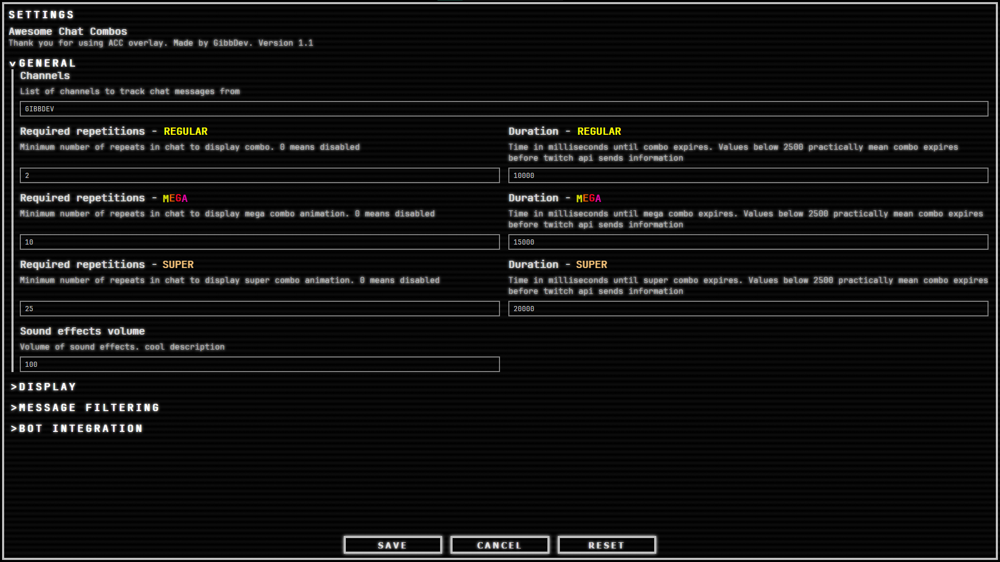

# Awesome chat combos

<h1>Instalation</h1>

1. Download `acc.zip` from 
2. Extract to desired location on your pc (make sure OBS has read access to that location)
3. In OBS add browser source that covers entire canvas
4. In source properties select `index.html` from extracted files (toggle local file checkbox **OR** open `index.html` in your browser and copy link from adress bar)
5. In obs when browser source selected click on the "Interact" button
6. That should bring up fading button to change settings on any mouse movement
7. Enter comma separated list of channel names and edit other settings to your hearts content
8. Click save and enjoy

To use with chat bot software:

1. open `assets/bot integration setups` folder and import actions/commands into your preffered bot
2. In overlay settings select bot integration type from a dropdown (or streamerbot there will be avaliable some additional settings. you will need them only if you know what they are)
3. IF actions were imported correctly and HAVEN'T had their names and groups changed overlay should find those and activate.

Avaliable interaction variables that overlay sends out:
- `accEventType` defines what type of event overlay emits
- `word` contains string of the combo word
- `repetitions` contains number of repetitions
- `level` contains level of the combo reached (1 -  regular, 2 - mega, 3 - super)
- `isEmote` contains a boolean (true/false) if combo was an emote
- `emoteURL` contains link to the emote image. if combo wasnt an emote this value is null
- `timestamp` unix timestamp of the event

<h1>Changelog</h1>

 <h2>1.2</h2>

 - Bugfix for failed image loading (forgor ' in image src html onfail OOPS)
 - Implemented sound system. check sounds folder in assets

<h1>Changelog</h1>

 <h2>1.1</h2>

 - Implemented bot integrations for following chat bot software:
 ,  and 
 - [BETA] Implemented sound support for combo achieved and expired events. I am missing sounds so its disabled for now
 - Remade settings menu from ground up to be more intuitive and have better UX (mainly written my own crude implementation of dropdown lists that actually works in limited browser engine of OBS browser source)
  
 
OLD vs NEW 
 
 
 

<h1>PREVIEWS</h1>

Settings menu: 
  
Combos: 

<h1>QnA</h1>

Q: **Does this cost anything in any way?** 
A: No. this is fully free to use, change or even distribute as long as you add appropriate attribution. *(Ex: ACC overlay by GIbbDev. link to repo if its a download source)*

Q: **Does it collect any data?** 
A: No. I am a sucker for stats and even then this doesnt store any data except settongs in browser source local storage of OBS. This is fully local processing of public data twitch, bttv, ffz and 7tv APIs provide

Q: **I cant do thing A. What do I do?** 
A: First, double check settings and make sure you cant do thing A. If still no - open an issue in this repository under `feature request` flair and we will discuss how fiesable it is to implement thing A.

Q: **I found a bug. What next?** 
A: Again, make sure its a bug and not user error. After that open an issue in this repository under `bug` flair

Q: **Cats or Dogs?** 
A: Cats. Not even a competition.

Q: **Can I contribute?** 
A: Depends. Open issue under `feature-request` flair with your proposition. In general im open to contributions as long as they are not AI slop pr

Q: **Was any AI used to create this?** 
A: No. No ai generated content was used or present in code that was written by me. I cannot vouch qith 100% certainty if this the case for TMI.js but I'm *pretty* sure they didnt

Q:  ? 
A: 

MIT license - GibbDev 2026