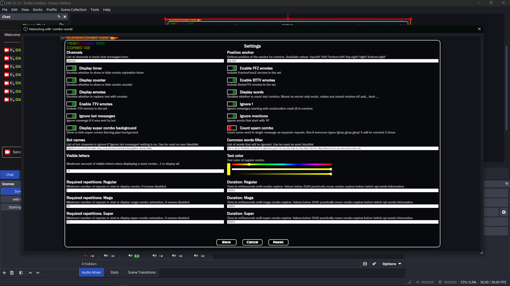
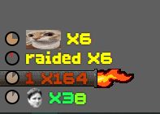

# Awesome chat combos

## Instalation
1. Download `acc.zip` from !releases](https://github.com/GibberishDev/stream-overlays/releases)
2. Extract to desired location on your pc (make sure OBS has read access to that location)
3. In OBS add browser source that covers entire canvas 

or not
 I'm not your parent. if you want to "zoom in" just make it less than canvas size and then stretch the source. Settings menu is built to work if its wider than 100px. but if you stream in resolutions less than fkn gameboy screen in width ya should be arrested

4. In source properties select `index.html` from extracted files (toggle local file checkbox **OR** open `index.html` in your browser and copy link from adress bar)
5. In obs when browser source selected click on the "Interact" button
6. That should bring up fading button to change settings on any mouse movement
7. Enter comma separated list of channel names and edit other settings to your hearts content
8. Click save and enjoy

## Previews
Settings menu: 
  
Combos: 

